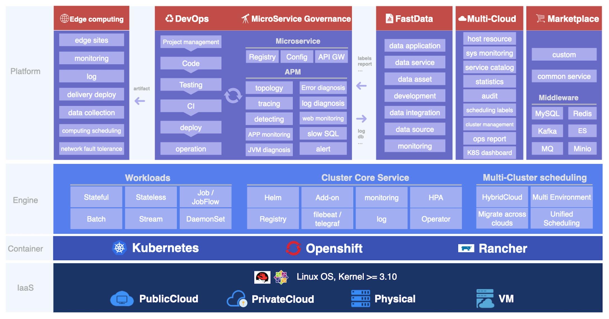

# Erda - An enterprise-grade application building, deploying, monitoring platform

## Introduction

Erda is an open-source platform created by [Terminus](https://www.terminus.io/) to ensure the development of microservice applications. It provides DevOps, microservice governance, and multi-cloud management capabilities. The multi-cloud architecture based on Kubernetes and application-centric DevOps and microservice governance can make the development, operation, monitoring, and problem diagnosis of complex business applications simpler and more efficient.

**Functional Architecture**

Erda is mainly composed of the following parts:
- DevOps
- Microservice Governance, including Application Performance Management, Monitoring, Log Analysis, API Gateway, etc.
- Multi-Cloud Management
- Edge Computing
- FastData Management

## Vision: Build any application, Deploy anywhere, Monitor anything

## Screenshot

## Architecture

We split the codes of erda into multiple repositories according to different functions. The key repositories are erda, erda-proto, erda-infra, erda-ui.

**erda** It is the main repository.

[erda-proto]: (https://github.com/erda-project/erda-proto) It stores the communication protocol definitions between erda internal services, and the componentized protocol definitions between the web front-end and back-end services.

[erda-infra]: (https://github.com/erda-project/erda-infra) It is a basic repository, which stores some common and basic module codes, including the wrappers of middleware SDK, etc.

[erda-ui]: (https://github.com/erda-project/erda-ui) It is erda's web system and an essential component of erda. Due to the separation of front-end and back-end, it is an independent repository.

## Quickstart

Quick start in your local: [quickstart](./docs/guides/quickstart/quickstart-full.md)

## Installation

Please use the following installation documents to install Erda.

- [English](./docs/guides/deploy/How-to-install-Erda.md)
- [简体中文](./docs/guides/deploy/How-to-install-Erda-zh.md)

## User Documentation

To start using Erda, please see the documentation.

- [简体中文](https://docs.erda.cloud)
- English

## Contributing

Contributions are always welcomed. Please refer to [Contributing to Erda](CONTRIBUTING.md) for details.

## Contact Us

If you have any questions, please feel free to contact us.

- Email: erda@terminus.io
- Twitter: [@ErdaProject](https://twitter.com/ErdaProject)
- Zhihu：[Erda技术团队](https://www.zhihu.com/people/erda-project) (A Chinese knowledge community, similar to Quora.)
- WeChat Official Account:

    
- DingTalk Group:
  
    

## License

Erda is under the AGPL 3.0 license. See the [LICENSE](LICENSE) file for details.
