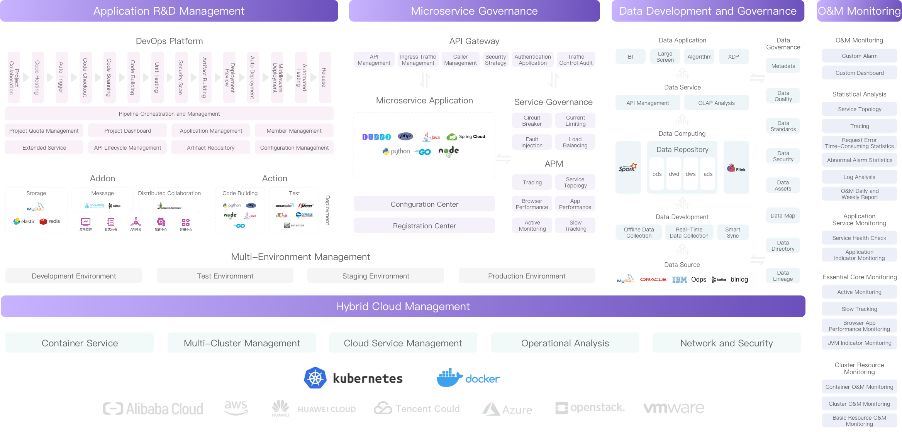
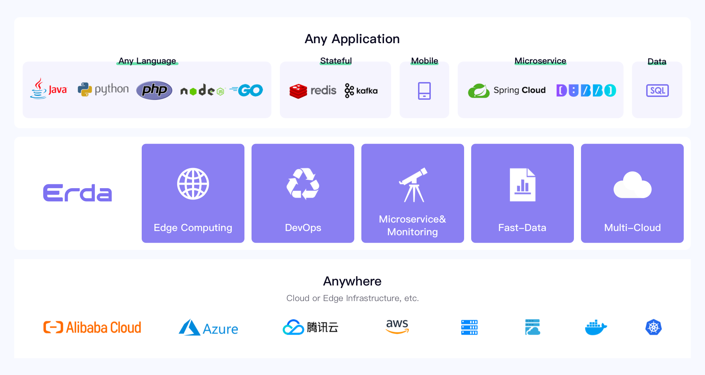
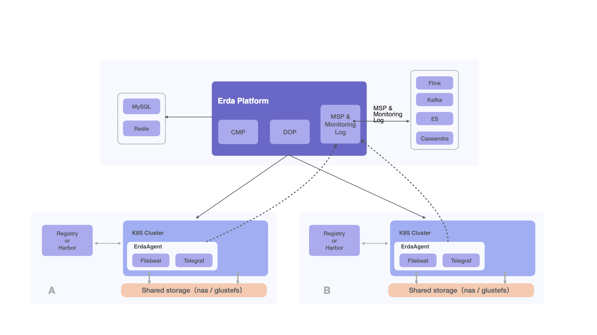

## An enterprise-grade Cloud-Native application platform

###  [Introduction](#Introduction) | [Quick Start](#Quick-Start) | [Installation](#Installation) | [Documentation](#User-Manual) | [CHANGELOG](./CHANGELOG/README.md) | [Contributing](#Contributing) 

## Demo

## Introduction

Erda is an open-source platform created by [Terminus](https://www.terminus.io/) to ensure the development of microservice applications. It provides DevOps, microservice governance, and multi-cloud management capabilities. The multi-cloud architecture based on Kubernetes and application-centric DevOps and microservice governance can make the development, operation, monitoring, and problem diagnosis of complex business applications simpler and more efficient.

**Functional Architecture**

Erda is mainly composed of the following parts:
- DevOps
- Microservice Governance, including Application Performance Management, Monitoring, Log Analysis, API Gateway, etc.
- Multi-Cloud Management
- Edge Computing
- FastData Management

## Vision: Build any application, Deploy anywhere, Monitor anything

## Architecture

The Erda project consists of multiple repsitories according to different functions. The key repositories are [erda](https://github.com/erda-project/erda), [erda-ui](https://github.com/erda-project/erda-ui), [erda-proto](https://github.com/erda-project/erda-proto), [erda-infra](https://github.com/erda-project/erda-infra), [erda-actions](https://github.com/erda-project/erda-actions), [erda-addons](https://github.com/erda-project/erda-addons), [docs](https://github.com/erda-project/docs).

### **[erda](https://github.com/erda-project/erda)** 

It is the core repository that implements all the RESTful and gRPC interfaces of the backend services of Erda platform by multiple components in microservice architecture. 

### **[erda-ui](https://github.com/erda-project/erda-ui)** 

It is the graphical user portal of Erda platform built with [React](https://github.com/facebook/react) with the help of which users can work upon Erda platform very easily. It talks with [erda](https://github.com/erda-project/erda) backend services in RESTful APIs.

### **[erda-proto](https://github.com/erda-project/erda-proto)** 

It defines a part of the communication protocols among erda backend services using [Protocol Buffers](https://developers.google.com/protocol-buffers). All the other protocols among erda backend services will be migrated here in the near future.

### **[erda-infra](https://github.com/erda-project/erda-infra)** 

It is a lightweight microservices framework implements by golang. It provides many popular middleware providers such as Redis, KafKa, etcd, etc.,  so that developers can build a module-driven application quickly with help of it. It is also integrated into almost all the backend components in [erda](https://github.com/erda-project/erda). 

### **[erda-actions](https://github.com/erda-project/erda-actions)**

It holds the definition for the official Pipeline Actions of the Erda Action Marketplace as found at https://www.erda.cloud/market/action. A Pipeline Action plays as a mininal runnable unit in [Erda Pipelines](https://docs.erda.cloud/1.0/manual/deploy/pipeline.html) such as checking out source code in github, buiding a docker image, creating a deployment in a Kubernetes cluster etc.. You can find more information about Pipeline Actions [here](https://docs.erda.cloud/1.0/manual/actions).

### **[erda-addons](https://github.com/erda-project/erda-addons)** 

It holds the definition for the official Addons of the Erda Addon Marketplace as found at https://www.erda.cloud/market/addon. An Addon holds the configration of a middleware like MySQL, Redis, etc. or a third-party service and it can be shared to different environments of applications, so that developers would not need to import the same configurations again and again in different environments. You can find more information about Erda Addons [here](https://docs.erda.cloud/1.0/manual/addons/out-of-the-box.html).

### **[docs](https://github.com/erda-project/docs)** 

It is the codebase of Erda documentation built with [vuepress](https://vuepress.vuejs.org).

There are some extra repositories that plays as customized third-partiy independent components and tools in Erda project such as 
* [erda-proto-go](https://github.com/erda-project/erda-proto-go) generated code for Erda protobuf data modals and protocols.
* [erda-analyzer](https://github.com/erda-project/erda-analyzer) is the streaming aggregator for metrics and alert data.
* [erda-java-agent](https://github.com/erda-project/erda-java-agent) is the apm java agent in Erda platform.
* [telegraf](https://github.com/erda-project/telegraf) is the plugin-driven server agent for collecting & reporting metrics.
* [kubeprober](https://github.com/erda-project/kubeprober) is a large-scale Kubernetes cluster diagnostic tool.
* [beats](https://github.com/erda-project/beats) is the lightweight shippers for Elasticsearch & Logstash.
* [remotedialer](https://github.com/erda-project/remotedialer) is a reverse tunneling dialer.
* [erda-bot](https://github.com/erda-project/erda-bot) is the bot handing Github webhooks.

## Quick Start

To get started, see [Quick Start](./docs/guides/quickstart/quickstart-full.md).

## Installation

Please refer to the following documentation to install Erda.

- [English](./docs/guides/deploy/How-to-install-Erda.md)
- [简体中文](./docs/guides/deploy/How-to-install-Erda-zh.md)

## User Manual

To start using Erda, please refer to the following documentation.

- English
- [简体中文](https://docs.erda.cloud)

## Contributing

Contributions are always welcomed. Please refer to [Contributing to Erda](CONTRIBUTING.md) for details.

## Contact Us

If you have any questions, please feel free to contact us.

- Email: erda@terminus.io
- Twitter: [@ErdaProject](https://twitter.com/ErdaProject)
- Zhihu：[Erda技术团队](https://www.zhihu.com/people/erda-project) (A Chinese knowledge community, similar to Quora.)
- WeChat Official Account:

    
- DingTalk Group:
  
    

## License

Erda is under the Apache 2.0 license. See the [LICENSE](LICENSE) file for details.
