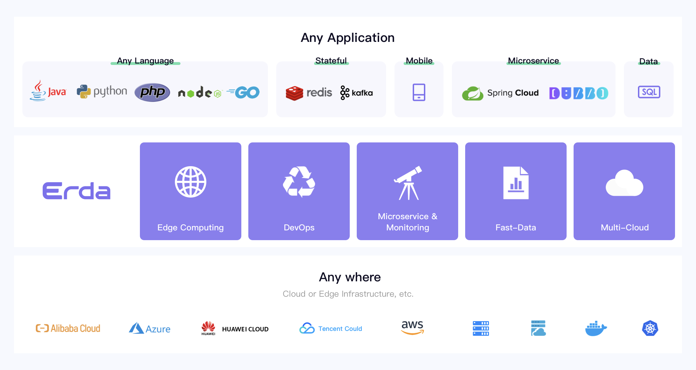

# Erda - An enterprise-grade application building, development, monitoring platform

## Introduction

Erda is an open-source platform created by [Terminus](https://www.terminus.io/) to ensuring the development of  microservice applications. It provides DevOps, microservice governance, and multi-cloud management capabilities. The multi-cloud architecture based on Kubernetes and application-centric DevOps and microservice governance can make the development, operation, monitoring, and problem diagnosis of complex business applications simpler and more efficient.

**Functional Architecture**

Erda is mainly composed of the following parts, they are
- DevOps
- Microservice Governance, include Application Performance Management, Monitoring, Log Analysis, API Gateway, etc.
- Multi-cloud Management
- Edge Computing
- FastData Management

## Erda's vision is "Build any application, Deploy anywhere, Monitor everything".

## Screenshot

## Architecture

We split the codes of erda into multiple repositories according to different function. The key repositories are erda, erda-proto, erda-infra, erda-ui.

**erda** It is the main repository.

[erda-proto](https://github.com/erda-project/erda-proto) Store the communication protocol definitions between erda internal services, and the componentized protocol definitions between the web front-end and back-end services.

[erda-infra](https://github.com/erda-project/erda-infra) It is a basic repository, which stores some common and basic module codes, including the wrappers of middleware SDK, etc.

[erda-ui](https://github.com/erda-project/erda-ui) It is erda's web system and an essential component of erda. Due to the separation of front-end and back-end, it is an independent repository.

## User Documentation

To start using Erda, please see our user documentation. Before using, you need to see the [installation document](./docs/guides/deploy/How-to-install-the-Erda.md) to install erda.

- [中文](https://dice-docs.app.terminus.io)
- English

## Contributing

This section is in progress here [Contributing to Erda](CONTRIBUTING.md)

## Contact Us

We look forward to your connecting with us, you can ask us any questions.

- Email: erda@terminus.io
- 知乎：[Erda技术团队](https://www.zhihu.com/people/erda-project) (A Chinese knowledge community, similar to Quora.)
- 微信公众号:

    
- 钉钉用户群:
  
    

## License

Erda is under the AGPL 3.0 license. See the [LICENSE](LICENSE) file for details.
