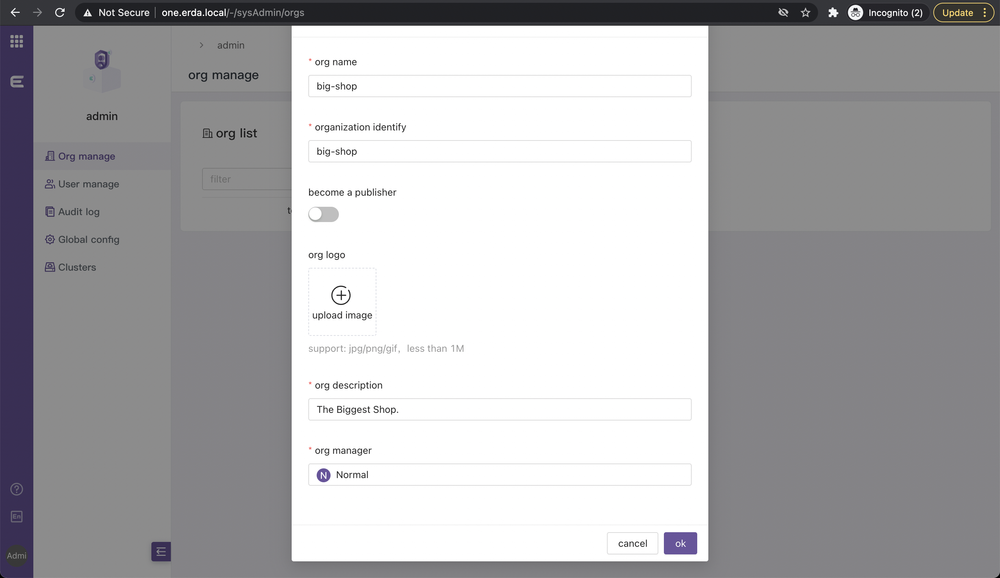
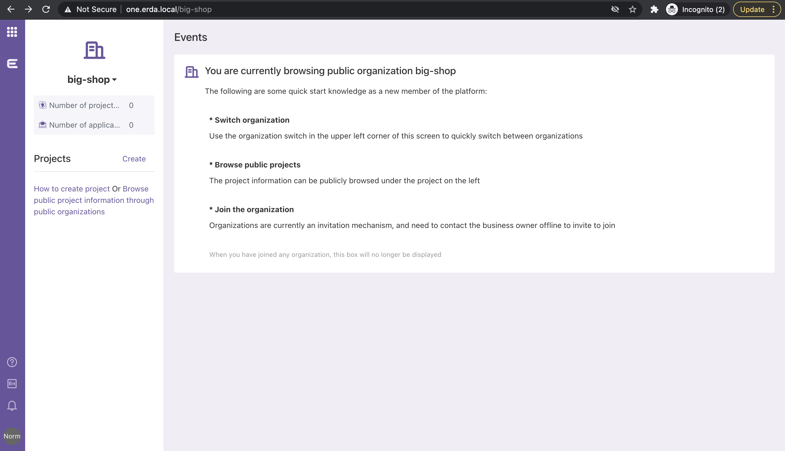

# Quickstart

## Requirements
* docker
* k8s cluster (optional, required for CI/CD)

## Setup

First, you need change directory to `quick-start`.

```shell
cd quick-start
```

Ensure successful execution of db-migration.

```shell
docker-compose up -d mysql
docker-compose up dbmigration-4
```

Then, run the rest of erda

```shell
docker-compose up -d
```

Finally, you need to host binding

```shell
# exec this cmd as super user, or manually edit /etc/hosts file
echo "127.0.0.1 erda.local one.erda.local" >> /etc/hosts
```

Visit erda using your browser: http://erda.local

## Try Erda
### Signup
Page will be redirected to sign-in page, you should switch to signup page.
And register your first account, this account will automatically become the admin.


It is best to log out first, register a normal user, and then login back to the admin.
Since the user management page is now broken, all users must create it by themselves at this time, we are fixing this bug.

### Create an org
Admin user can create org by entering required fields.
Grant the normal user we created before as org manager.



### Switch to normal user
We log in as a normal user, and the page will be redirected to the personal dashboard.
As an org manager, we can create projects.



### Next
You can read our official `User Documentation` to learn how to use erda for DevOps and other practices.

https://docs.erda.cloud

## Known Issues
* there are some problems of db-migration, which causes us to manually keep the startup order
* you must have a dedicated admin account (admin cannot access DOP, MSP)
* user management page is broken, all users must create by self (signup page)
* you must do host binding (erda.local in /etc/hosts)
* only guarantee DOP (DevOps Platform) works, and others such as MSP, ECP are not

## Cleanup

```shell
docker-compose down -v
docker-compose rm -fsv
```
