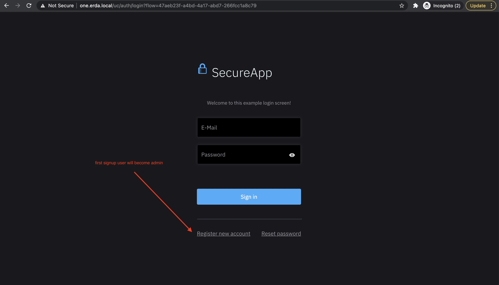
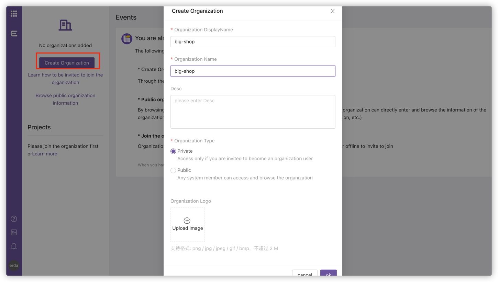

# Quickstart

## Requirements
* docker `20.10.0+` with docker-compose
* k8s cluster (optional, required for CI/CD)
* host resource required: 4 Cores with 8 GB RAM

## One-line script setup
```
/bin/bash -c "$(curl -fsSL https://raw.githubusercontent.com/erda-project/erda/master/quick-start/quick-start.sh)"
```

If you encounter problems using the script above to set up erda, try manually set up following the steps described bellow.

## Setup

First, you need change directory to `quick-start`.

```shell
cd quick-start
```

Ensure successful execution of db-migration.

```shell
docker-compose up -d mysql
docker-compose up erda-migration
```

Then, run the rest of erda

```shell
docker-compose up -d
```

Finally, you need to host binding

```shell
# exec this cmd as super user, or manually edit /etc/hosts file
echo "127.0.0.1 erda.local one.erda.local" >> /etc/hosts
```

Visit erda using your browser: http://erda.local

## Try Erda
### Signup
Page will be redirected to sign-in page, you should switch to signup page.
And register your first account, this account will automatically become the admin.



Since the user management page is now broken, all users must register account by themselves, we are fixing this bug.
The first registered user would become the Admin account, which is used for some special management cases but cannot be used to manage projects, so it's recommended that you log-out when first registered and register another normal user for full feature use.

### Create an org
Sign in as a normal user, you will see a guide page, you can create organization by click the `Create Organization` button.



### Next
You can read our official `User Documentation` to learn how to use erda for DevOps and other practices.

https://docs.erda.cloud

## Known Issues
* there are some problems of db-migration, which causes us to manually keep the startup order
* you must have a dedicated admin account (admin cannot access DOP, MSP)
* user management page is broken, all users must create by self (signup page)
* you must do host binding (erda.local in /etc/hosts)
* only guarantee DOP (DevOps Platform) works, and others such as MSP, ECP are not

## Cleanup

```shell
docker-compose down -v
docker-compose rm -fsv
```
